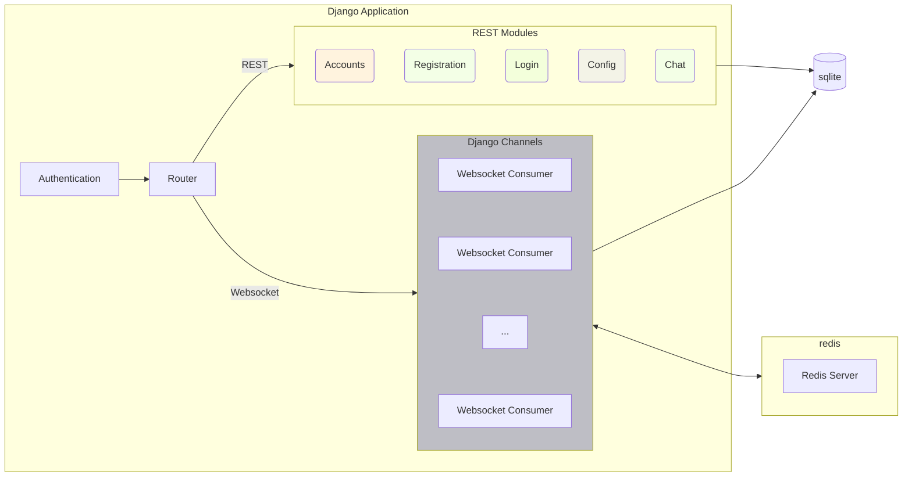

# Backend

```mermaid
graph LR
  classDef classA fill:#ffd1dc45;
  classDef classB fill:#d1fffc45;
  classDef classC fill:#d1ffd145;
  classDef classD fill:#d1d1ff45;
  classDef classE fill:#ffd1d145;
  classDef classChannels fill:#10108045

  subgraph django_app["Django Application"]
    subgraph modules[REST Modules]
      A(Accounts):::classA
      B(Registration):::classB
      C(Login):::classC
      D(Config):::classD
      E(Emails):::classE
      E(Chat):::classB
    end

    Authentication --> Router
      Router -->|REST| modules
      Router -->|Websocket| django_channels

    subgraph django_channels["Django Channels"]
      direction TB

      C1[Websocket Consumer]
      C2[Websocket Consumer]
      C3[...]
      C4[Websocket Consumer]

      C1 ~~~ C2
      C2 ~~~ C3
      C3 ~~~ C4
    end
    class django_channels classChannels
  end

  modules --> DB[(sqlite)]
  django_channels --> DB[(sqlite)]

  
  subgraph redis
    H[Redis Server]
  end

  django_channels <--> redis

```
