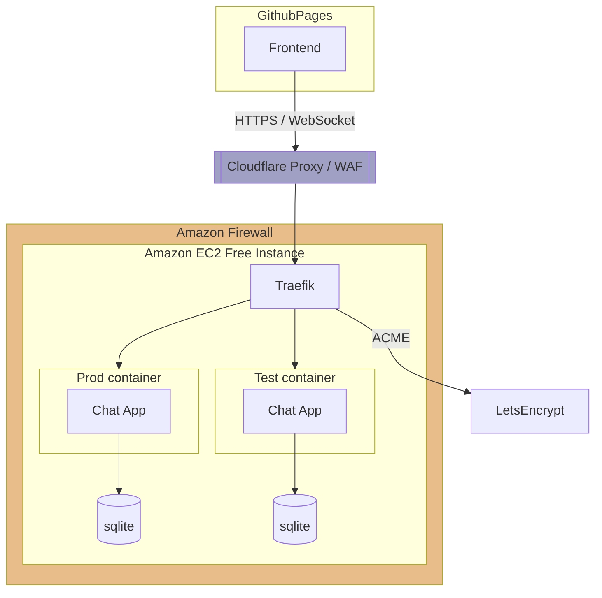

# Deployment Diagram

-   Github Pages: https://pages.github.com/
-   WAF: https://developers.cloudflare.com/waf/
-   AWS Free Tier: https://aws.amazon.com/free/
-   Traefik & Let’s Encrypt: https://doc.traefik.io/traefik/https/acme/
-   Docker: https://docs.docker.com/get-started/overview/
